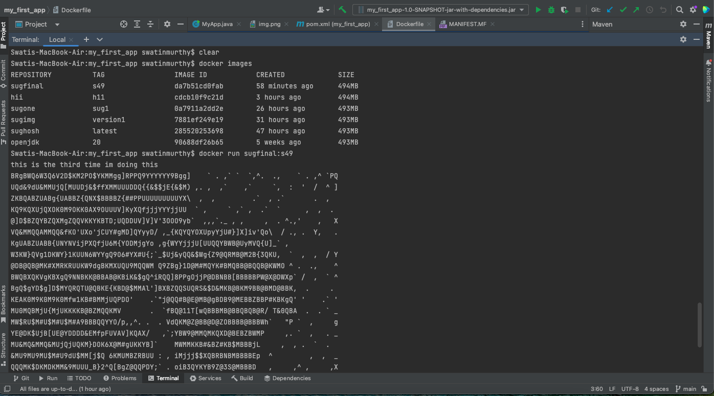

Dockerfinal with ascii :

<h3>What is the prerequisite for another machine to run your application if you provide it the docker image ? </h3>
<ol>
<li>Operating system - docker image made in any operating system can be run on any operating system.  
<li>pre-installed app - Docker desktop, docker 
<li>System support: 
<li>64-bit kernel and CPU support for virtualization. 
<li>KVM virtualization support.  
<li>QEMU must be version 5.2 or newer.  
<li>systemd init system. 
<li>Gnome, KDE, or MATE Desktop environment.  
<li>At least 4 GB of RAM. 
</ol>

<h3>What is the difference between a virtual machine and a docker container ?
</h3>

VMs have the host OS and guest OS inside each VM. A guest OS can be any OS, like Linux or Windows, irrespective of the host OS. In contrast, Docker containers host on a single physical server with a host OS, which shares among them. 
Virtual Machine:
It runs on top of an emulating software called the hypervisor which sit between the hardware and the virtual machine. The hypervisor is the key to enable virtualization. It manages the sharing of physical resources into virtual machines. Each virtual machine runs its own guest operating system. They are less agile and have low portability than containers.

Container:
It sits on the top of a physical server and its host operating system. They share a common operating system that requires care and feeding for bug fixes and patches. They are more agile and have high portability than virtual machines.
